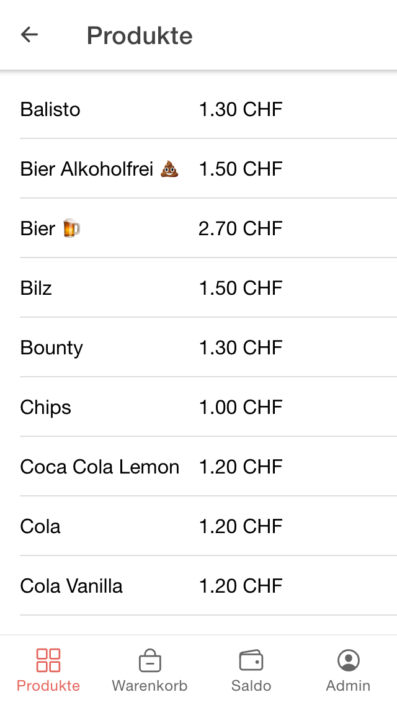
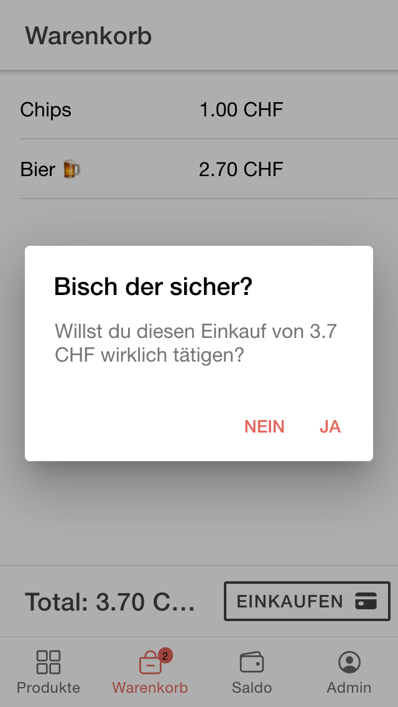
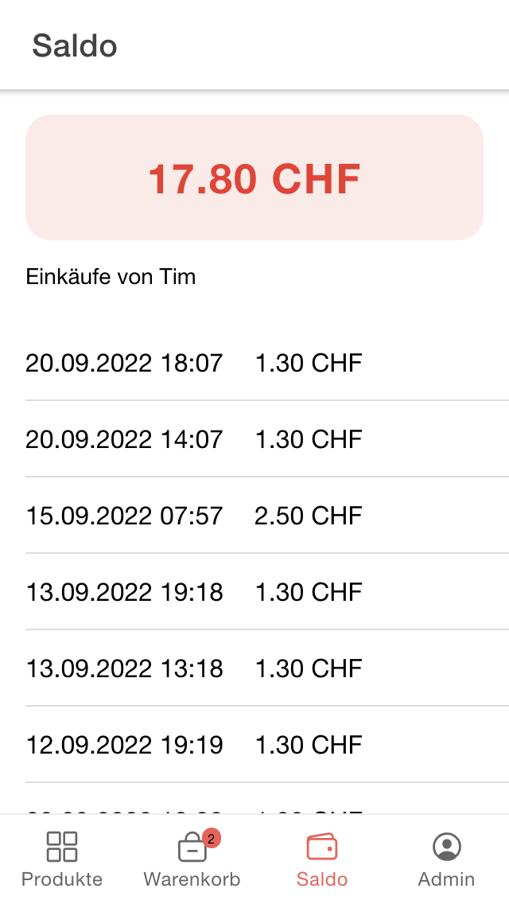

# BFA

This repo contains the BFA (Bataillonsinterner Finanzausgleich), one of total 3 components from the <a href="https://github.com/biersoeckli/attendance-list">attendance list</a>.

<b>List of all components:</b>
- <a href="https://github.com/biersoeckli/attendance-list">Attendance List</a>
- <a href="https://github.com/biersoeckli/bfa">BFA (Bataillonsinterner Finanzausgleich) (this repo)</a>
- <a href="https://github.com/biersoeckli/fischmarkt">Fischmarkt</a>

## What's this?

The BFA is a Self-Checkout-Kiosk-System. It was originally created to purchase products at the internal <a href="https://www.vtg.admin.ch/de/mein-militaerdienst/allgemeines-zum-militaerdienst/dienstpflicht.html">WK</a>-Kiosk in a Swiss Army bataillon.

# Preview

<table>
  <tr>
    <td>
      
    </td>
    <td>
      
    </td>
    <td>
      
    </td>
  </tr>
</table>

